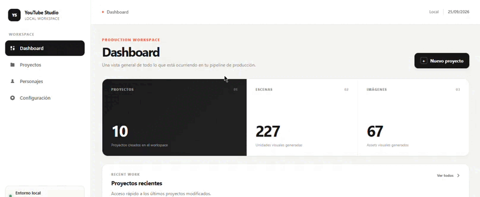

# YouTube Studio

### Local-first AI production workspace for faceless YouTube channels

> Plan, generate, organize and prepare an entire YouTube video — from source material to production-ready assets — inside one local workspace.

[](https://laravel.com/)
[](https://www.php.net/)
[](https://getbootstrap.com/)
[](https://www.mysql.com/)
[](https://www.docker.com/)
[](#ai-pipeline)

---

<!--
DEMO VISUAL
Recommended asset:
docs/demo/youtube-studio-demo.gif

Recommended recording:
8–15 seconds
1. Dashboard
2. Open a real project
3. Show Storyboard
4. Show Image Gallery
5. Return to Dashboard

Keep the cursor visible and use a project with real generated assets.
-->

<p align="center">
  
</p>

<p align="center">
  <sub>Visual demo — project dashboard, storyboard and generated assets.</sub>
</p>

---

<!-- SCREENSHOT #1 — HERO
Add the strongest static screenshot here if you want one in addition to the GIF.

Recommended:
docs/screenshots/dashboard.webp
-->


---

## The idea

YouTube production gets messy long before the editing stage.

Research lives in one place. Transcripts live somewhere else. Scripts become disconnected from visual direction. Image prompts become inconsistent. Generated assets get mixed together. Character references are reused manually. Production notes become difficult to track.

**YouTube Studio turns that entire pre-production pipeline into one structured workspace.**

A project represents a complete video.

```text
Source
   ↓
Transcription
   ↓
Content generation
   ↓
Script
   ↓
Storyboard
   ↓
Visual direction
   ↓
Image generation
   ↓
Voice generation
   ↓
Timing / production data
   ↓
Production package
```

The application is deliberately **not an automatic video editor**.

Its job is to take a video concept from raw source material to a clean, structured and production-ready package.

---

# What it does

## Project management

Every video is represented by a dedicated project containing:

* source URL and title
* transcript
* generated script
* YouTube title
* description
* keywords
* hashtags
* thumbnail concept
* thumbnail text
* ordered scenes
* generated images
* voiceover
* production metadata

Each project gets its own isolated storage structure.

```text
storage/
└── app/
    └── private/
        └── projects/
            └── {project_id}/
                ├── source/
                ├── transcript/
                ├── script/
                ├── storyboard/
                ├── images/
                ├── audio/
                ├── production/
                └── ...
```

Nothing from different projects is mixed together.

---

## Structured AI content generation

Claude acts as the content director.

Instead of simply generating a block of text, the system expects structured production data:

```json
{
  "video": {
    "title": "...",
    "alternative_titles": [],
    "description": "...",
    "keywords": [],
    "hashtags": [],
    "thumbnail_concept": "...",
    "thumbnail_text": "..."
  },
  "content": {
    "hook": "...",
    "script": "...",
    "structure": "..."
  },
  "scenes": [
    {
      "order": 1,
      "narration": "...",
      "visual_concept": "...",
      "visual_description": "...",
      "visual_metaphor": "...",
      "character_role": "...",
      "shot_type": "...",
      "image_prompt": "...",
      "manual_elements": [],
      "animation_notes": "...",
      "production_notes": "..."
    }
  ]
}
```

This distinction is important.

The AI is not only writing the script.

It is producing the **blueprint for the visual production**.

---

# The visual direction system

One of the core ideas behind the application is separating what the narration says from what the audience should actually see.

The visual pipeline follows:

```text
NARRATION
    ↓
VISUAL CONCEPT
    ↓
VISUAL METAPHOR
    ↓
VISUAL DESCRIPTION
    ↓
IMAGE PROMPT
    ↓
GENERATED IMAGE
```

### Visual concept

The exact idea the viewer should understand visually.

### Visual metaphor

The concrete visual representation used to communicate that idea.

### Visual description

What physically exists inside the scene.

### Image prompt

The compact instruction sent to the image provider.

This prevents the common AI-generation problem of creating an attractive image that is only loosely related to the narration.

---

# Consistent character generation

Characters are managed as reusable entities rather than being embedded randomly into prompts.

A character can have two master references:

```text
Character Reference Sheet
Character Portrait Reference
```

These references are used to preserve visual identity across generations.

For the Detective Stickman visual universe, the application uses a consistent editorial illustration language:

* 2D editorial cartoon
* controlled black linework
* geometric simplified shapes
* expressive silhouettes
* restrained color palette
* medium visual detail
* strong composition
* foreground / background separation
* visual metaphors over literal depictions when appropriate

The Detective is treated as a recurring visual character rather than the subject of every frame.

Generic stickmen remain anonymous and visually simple.

---

<!-- SCREENSHOT #2 — CHARACTER LIBRARY
Recommended:
docs/screenshots/characters.webp
-->


---

# AI pipeline

The application uses provider-based architecture so the production pipeline does not depend directly on a single external service.

```text
                 ┌────────────────────┐
                 │    Laravel Core    │
                 └─────────┬──────────┘
                           │
        ┌──────────────────┼──────────────────┐
        │                  │                  │
        ▼                  ▼                  ▼
  AI Provider       Image Provider    Transcription Provider
        │                  │                  │
        ▼                  ▼                  ▼
     Claude             FLUX 2 Pro        Whisper
        │
        └────────────────────────────┐
                                     │
                                     ▼
                               ElevenLabs
                               Voice + timing
```

### Claude

Responsible for:

* content analysis
* new script generation
* title generation
* metadata
* thumbnail concept
* scene planning
* visual direction

### Whisper

Responsible for:

* local transcription
* source-to-text conversion

The transcription layer is designed as a provider, making it possible to use different transcription sources without changing the rest of the application.

### FLUX 2 Pro

Responsible for:

* scene image generation
* individual image regeneration
* character-reference guided generation

The application centralizes the visual style system in the image provider instead of duplicating the complete style bible inside every scene prompt.

### ElevenLabs

Responsible for:

* voiceover generation
* character-level alignment
* scene timing

The generated timing data becomes the foundation for future video synchronization.

---

# Real audio timing

Voice generation does not rely on estimated scene durations.

ElevenLabs alignment data is used to derive actual scene timing.

The application stores both:

```json
{
  "duration": 327.846,
  "duration_timecode": "00:05:27:20",
  "fps": 24
}
```

and scene-level timing:

```json
{
  "scene": 1,
  "start": 0.000,
  "end": 6.421,
  "duration": 6.421,
  "start_timecode": "00:00:00:00",
  "end_timecode": "00:00:06:10",
  "duration_timecode": "00:00:06:10"
}
```

The project therefore has a real production timeline instead of relying on approximate AI-generated estimates.

---

<!-- SCREENSHOT #3 — PROJECT DETAIL
Recommended:
docs/screenshots/project-detail.webp
-->


---

# Storyboard

The storyboard is the central bridge between the script and the final visual production.

Each scene contains:

* narration
* visual concept
* visual description
* visual metaphor
* character role
* shot type
* image prompt
* manual elements
* animation notes
* production notes
* image status

Scenes can be reordered with drag & drop.

The system also supports:

* individual image generation
* individual image regeneration
* batch image generation
* production notes
* manual overlays / elements
* image status tracking

---

<!-- SCREENSHOT #4 — STORYBOARD
Recommended:
docs/screenshots/storyboard.webp
-->


---

# Image generation

The image gallery is intentionally separated from the storyboard.

This gives two different production views:

### Storyboard

"What should this scene contain?"

### Gallery

"What visual assets have actually been generated?"

Generated assets are stored using deterministic scene-based names:

```text
001.png
002.png
003.png
...
```

This makes asset ordering predictable and simplifies later production workflows.

---

<!-- SCREENSHOT #5 — IMAGE GALLERY
Recommended:
docs/screenshots/gallery.webp
-->


---

# Production package

A project can be exported as a self-contained ZIP package.

The package contains the project's production data and assets, including:

```text
project/
├── source/
├── transcript/
├── script/
├── storyboard/
├── images/
├── audio/
├── production/
├── project.json
├── scenes.json
└── MANIFEST.txt
```

The package can be imported on another installation.

Example:

```bash
docker compose exec app php artisan youtube:import \
    "storage/app/imports/project.zip" \
    --character=1
```

This makes the project portable between machines without requiring the original database.

---

<!-- SCREENSHOT #6 — PRODUCTION GUIDE
Recommended:
docs/screenshots/production-guide.png
-->


---

# Production Guide

The application can generate a production-oriented document for the storyboard.

Each scene becomes a dedicated production sheet containing:

* scene number
* character role
* shot type
* narration
* visual concept
* visual direction
* generated image
* manual elements
* animation notes
* production notes
* image prompt

The document is designed to be useful outside the application — including printing or handing production notes to another person.

---

# Application architecture

The project follows a service-oriented Laravel architecture.

```text
app/
├── Contracts/
│   ├── AI/
│   ├── Images/
│   ├── Transcription/
│   └── Voice/
│
├── Jobs/
│   ├── GenerateContentJob.php
│   ├── GenerateSceneImageJob.php
│   └── GenerateAllImagesJob.php
│
├── Models/
│   ├── Project.php
│   ├── Scene.php
│   └── Character.php
│
├── Services/
│   ├── AIContentService.php
│   ├── StoryboardService.php
│   ├── TranscriptionService.php
│   ├── ImageGenerationService.php
│   ├── VoiceGenerationService.php
│   ├── ProductionPackageService.php
│   └── ProductionPackageImportService.php
│
└── ...
```

The important architectural principle is:

```text
Controller
    ↓
Service
    ↓
Provider Interface
    ↓
Concrete Provider
```

For example:

```text
AIContentService
        ↓
     AIProvider
        ↓
    ClaudeProvider
```

This allows providers to evolve without coupling the rest of the application to a specific API implementation.

---

# Why provider abstraction matters

The system can evolve from:

```text
ClaudeProvider
```

to another AI provider without rewriting:

* controllers
* Blade views
* project models
* storyboard logic
* jobs
* storage structure

The same principle applies to:

```text
ImageProvider
TranscriptionProvider
VoiceProvider
```

The provider is replaceable.

The production workflow is not.

---

# Local-first architecture

The application was intentionally built around a local development workflow.

```text
Windows
   │
   └── Docker Compose
          ├── Laravel / PHP
          ├── MySQL
          └── Node / Vite
```

This keeps the application reproducible while allowing the heavy AI work to remain provider-based.

There is currently no requirement for:

* hosting
* authentication
* multi-user infrastructure
* cloud file management
* automatic publishing

The focus is the production workflow.

---

# Tech stack

| Layer            | Technology                   |
| ---------------- | ---------------------------- |
| Backend          | Laravel 13                   |
| Language         | PHP 8.5                      |
| Frontend         | Blade                        |
| UI               | Bootstrap 5 + custom CSS     |
| JavaScript       | Vanilla JS                   |
| Build tooling    | Vite                         |
| Database         | MySQL 8.4                    |
| Environment      | Docker Compose               |
| AI               | Anthropic Claude             |
| Image generation | Black Forest Labs FLUX 2 Pro |
| Transcription    | Whisper                      |
| Voice            | ElevenLabs                   |
| Storage          | Laravel local filesystem     |
| Documents        | PDF production guides        |
| Packaging        | ZIP export/import            |

No React.

No Vue.

No Next.js.

No Tailwind.

The frontend is intentionally simple, maintainable and server-rendered.

---

# Getting started

## Requirements

You need:

* Docker Desktop
* Docker Compose
* a configured `.env`
* API keys for the external providers you intend to use

The project is designed to run locally through Docker.

---

## Start the application

```bash
docker compose up -d --build
```

Then check the application:

```bash
docker compose ps
```

Laravel commands should be executed inside the application container.

For example:

```bash
docker compose exec app php artisan migrate
```

Clear Laravel caches when changing configuration:

```bash
docker compose exec app php artisan optimize:clear
```

---

# Environment configuration

External provider credentials should live in `.env`.

Typical configuration includes:

```env
ANTHROPIC_API_KEY=
BFL_API_KEY=
ELEVENLABS_API_KEY=
```

Provider-specific configuration is resolved through Laravel configuration files and is never intended to be stored in the application database.

---

# Useful Artisan commands

## Create a production package

```bash
docker compose exec app php artisan youtube:package 10
```

## Import a production package

```bash
docker compose exec app php artisan youtube:import \
    "storage/app/imports/project.zip" \
    --character=1
```

## Clear application caches

```bash
docker compose exec app php artisan optimize:clear
```

## Run migrations

```bash
docker compose exec app php artisan migrate
```

---

# Production workflow

A typical project workflow looks like this:

```text
1. Create Project
       ↓
2. Add YouTube source
       ↓
3. Transcribe
       ↓
4. Generate Content
       ↓
5. Review Script
       ↓
6. Generate Storyboard
       ↓
7. Review / Reorder Scenes
       ↓
8. Generate Images
       ↓
9. Regenerate individual scenes if needed
       ↓
10. Generate Voice
       ↓
11. Review Timing
       ↓
12. Export Production Package
```

The important part is that every stage remains inspectable.

Nothing is hidden behind a single "Generate Video" button.

---

# Design philosophy

The application intentionally uses a restrained visual system.

### UI

* warm off-white background
* white production surfaces
* nearly-black typography
* subtle borders
* restrained shadows
* small radii
* orange accent color
* compact metadata
* strong spacing hierarchy

### Visual production

* editorial cartoon language
* strong silhouettes
* deliberate composition
* visual metaphors
* controlled linework
* consistent character identity
* medium visual complexity

The interface and the generated content therefore share the same philosophy:

**structured, minimal, intentional.**

---

# What makes this project interesting

This project is not simply an interface around a few APIs.

The interesting part is the orchestration layer between them.

The system has to keep several things aligned:

```text
Narrative
   ↕
Script
   ↕
Scene
   ↕
Visual direction
   ↕
Image generation
   ↕
Character references
   ↕
Voice generation
   ↕
Timing
   ↕
Production package
```

A change in one stage should not destroy the structure of the rest of the project.

That is the main engineering problem this application is designed around.

---

# Current status

The project is actively evolving.

### Implemented

* project management
* character library
* project-specific storage
* structured AI content generation
* storyboard generation
* visual concept / metaphor workflow
* character references
* FLUX image generation
* image regeneration
* image gallery
* voice generation
* ElevenLabs character alignment
* 24 fps timecode
* production guide generation
* ZIP project export
* ZIP project import
* Docker-based local environment
* provider abstraction
* production-oriented UI

### Intentionally not implemented

* automatic video editing
* automatic YouTube publishing
* automatic thumbnail generation
* subtitles
* automatic trend research
* multi-user authentication
* billing
* SaaS infrastructure

The project is focused on **production orchestration**, not becoming a full video editor.

---

# Roadmap

```text
[x] Project management
[x] Character references
[x] AI content generation
[x] Structured storyboard
[x] Image generation
[x] Image regeneration
[x] Voice generation
[x] Real audio alignment
[x] Production package
[x] Production guide

[ ] Timeline / edit preparation
[ ] Automatic scene-to-audio synchronization
[ ] Subtitles
[ ] FFmpeg production pipeline
[ ] Automatic video assembly
[ ] Thumbnail generation
[ ] YouTube publishing
[ ] Research / topic discovery
```

The long-term goal is not to replace creative decisions.

It is to remove the repetitive organizational work around them.

---

# Screenshots & demo assets

The visual side of the project is important enough to deserve its own section.

Recommended assets:

```text
docs/
├── demo/
│   └── youtube-studio-demo.gif
│
└── screenshots/
    ├── dashboard.webp
    ├── projects.webp
    ├── project-detail.webp
    ├── storyboard.webp
    ├── gallery.webp
    ├── characters.webp
    └── production-guide.png
```

### Recommended capture order

**Demo GIF**

Dashboard → Project → Storyboard → Gallery → back to Dashboard.

**Dashboard**

Show the full application shell with several real projects.

**Project Detail**

Show the pipeline and current project state.

**Storyboard**

Use a project with many scenes and visible visual direction metadata.

**Gallery**

Use a project with several strong generated images.

**Characters**

Show the Detective Stickman references.

**Production Guide**

Show one rendered production sheet.

The strongest README will use **real screenshots from the application**, not mockups.

---

# Project structure

```text
youtube-studio/
│
├── app/
│   ├── Contracts/
│   ├── Http/
│   ├── Jobs/
│   ├── Models/
│   └── Services/
│
├── database/
│   ├── migrations/
│   └── seeders/
│
├── resources/
│   ├── css/
│   ├── js/
│   └── views/
│
├── routes/
│   └── web.php
│
├── storage/
│   └── app/
│       └── private/
│           ├── projects/
│           ├── characters/
│           └── packages/
│
├── docker-compose.yml
├── package.json
├── composer.json
└── README.md
```

---

# Engineering principles

The project follows a few simple rules:

### Keep the workflow explicit

Each production stage has its own state and data.

### Keep providers replaceable

External services should not leak into controllers or views.

### Keep generated assets isolated

Every project owns its own filesystem structure.

### Keep AI output structured

The application consumes production data, not arbitrary blobs of generated text.

### Keep visual consistency intentional

Style rules belong to the visual system, not duplicated randomly across prompts.

### Keep the application maintainable

No unnecessary framework complexity.

No frontend framework unless there is a real reason to introduce one.

---

# Final goal

YouTube Studio is being built as a **production operating system for a faceless YouTube workflow**.

Not a chatbot.

Not a prompt box.

Not a video editor.

A structured workspace where:

```text
ideas
  ↓
research
  ↓
content
  ↓
storytelling
  ↓
visual direction
  ↓
assets
  ↓
voice
  ↓
timing
  ↓
production
```

can all exist inside the same project.

---

## Built with

Laravel · PHP · Blade · Bootstrap · MySQL · Docker · Claude · Whisper · FLUX · ElevenLabs

### Local-first. Structured. Visual. Production-oriented.
